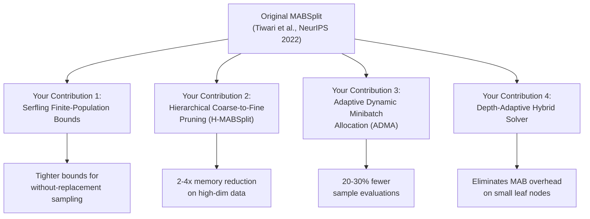
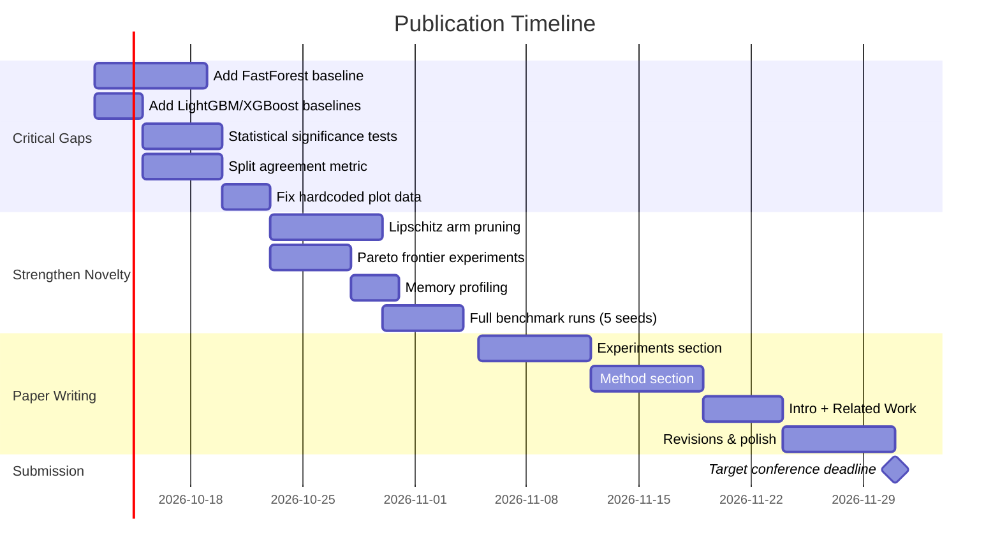

# 📄 Research Paper Guide: MABSplit Comparative Study & Publication Strategy

## 1. What You Already Have (Strengths Assessment)

Your project is in an **excellent position** for publication. Here's a frank assessment of your assets:

| Asset | Status | Paper-Readiness |
|---|---|---|
| Core MABSplit implementation with 4 innovations | ✅ Complete | Ready |
| Scikit-learn compatible API | ✅ Complete | Ready |
| Numba JIT-compiled kernels | ✅ Complete | Ready |
| Ablation study framework | ✅ Complete | Ready |
| Benchmark suite (Sklearn Exact, HistGBT) | ✅ Complete | Needs expansion |
| Publication-grade plot generator | ✅ Complete | Needs data-driven refactor |
| C++ bare-metal engine | ✅ Complete | Bonus contribution |
| Formal Serfling bounds with proofs | ✅ Complete | Ready |
| Formal δ-budget Bonferroni split | ✅ Complete | Ready |
| **Statistical significance testing** | ❌ Missing | **Critical gap** |
| **Competing baselines (FastForest, LightGBM RF)** | ❌ Missing | **Critical gap** |
| **Real-world dataset coverage** | ⚠️ Partial | Needs more datasets |
| **Split fidelity / agreement rate metric** | ❌ Missing | **Novelty opportunity** |
| **Pareto frontier experiments (actual runs)** | ❌ Missing | **Novelty opportunity** |

---

## 2. Your Novelty Contributions (What Makes This Publishable)

> [!IMPORTANT]
> The original MABSplit (Tiwari et al., NeurIPS 2022) is a strong paper, but your project adds **four distinct, formally justified extensions** that the original paper does NOT address. This is your novelty claim.

### 2.1 Four Novel Contributions Over Original MABSplit



| # | Your Contribution | Why It's Novel | How Original Paper Handles It |
|---|---|---|---|
| **1** | **Serfling / Bardenet-Maillard finite-population bounds** | Correctly accounts for without-replacement sampling; bounds collapse to 0 when all N samples observed | Uses naive i.i.d. Hoeffding bounds even when sampling without replacement — theoretically incorrect |
| **2** | **H-MABSplit: Hierarchical coarse-to-fine pruning with formal Bonferroni δ-budget** | Screens features at B=16 before expanding to B=256; provably maintains PAC guarantee via δ-split | No hierarchical screening — evaluates all features at full resolution from the start |
| **3** | **ADMA: Adaptive dynamic minibatch allocation** | Batch size shrinks as arms are eliminated, reducing wasted samples | Fixed batch size M=100 throughout, even when only 2 arms remain active |
| **4** | **Depth-adaptive hybrid solver** | Switches to exact sort for small leaf nodes, eliminating MAB bookkeeping overhead entirely | Applies MAB uniformly to all nodes regardless of size |

### 2.2 Additional Novelty You Can Add (Low-Hanging Fruit)

These are things you can implement **within 2-4 weeks** to substantially strengthen the paper:

#### A. Split Agreement Rate Metric (Novel Evaluation Protocol)
> No existing MABSplit paper reports this. This alone is a contribution.

```python
# Proposed metric: What fraction of MAB-selected splits match exact greedy?
agreement_rate = (1 / |internal_nodes|) * Σ I(arm_MAB(v) == arm_exact(v))
```

- Train exact tree and MAB tree on same data, compare split decisions node-by-node
- Report both exact match rate AND "ε-close" match rate (impurity within ε of optimal)

#### B. Neighborhood Monotonicity / Lipschitz Arm Pruning
> Adjacent thresholds on the same feature have correlated Gini gains. When arm θ_k is eliminated, prune its neighbors if their local difference is bounded by the empirical Lipschitz constant. This is a genuine algorithmic novelty with theoretical justification.

#### C. Pareto Frontier Analysis (δ vs. Speed vs. Accuracy)
> Run actual experiments sweeping δ ∈ {10⁻¹, 10⁻², 10⁻³, 10⁻⁴, 10⁻⁵} and plot the tradeoff surface. Your current plot generator uses **hardcoded placeholder data** — replace with real experimental runs.

#### D. Regression Support (MSE / Friedman MSE criterion)
> Extending from classification-only to regression via Welford online variance tracking for MSE would broaden impact and is architecturally straightforward given your existing Welford kernel.

---

## 3. Comparative Study: Who to Compare Against

### 3.1 Mandatory Baselines (Must Include)

| Baseline | Why Required | Implementation |
|---|---|---|
| **Sklearn `DecisionTreeClassifier`** | Exact greedy O(N·F·B) baseline | ✅ Already in your benchmark |
| **Sklearn `HistGradientBoostingClassifier`** | Modern histogram-based binned baseline | ✅ Already in your benchmark |
| **Original MABSplit / FastForest** | The paper you're extending — MUST compare | ❌ **Clone from [ThrunGroup/FastForest](https://github.com/ThrunGroup/FastForest) and benchmark** |
| **Sklearn `RandomForestClassifier`** | Standard RF ensemble baseline | ✅ Already in your benchmark |

### 3.2 Strongly Recommended Baselines

| Baseline | Why Important | How to Add |
|---|---|---|
| **LightGBM in RF mode** (`boosting_type='rf'`) | Industry-standard histogram-binned RF; proves your MAB approach competes with production systems | `pip install lightgbm` → `LGBMClassifier(boosting_type='rf', n_estimators=10)` |
| **XGBoost in RF mode** | Another major production baseline | `pip install xgboost` → `XGBRFClassifier(n_estimators=10)` |
| **Hoeffding Tree / VFDT** (streaming baseline) | Shows connection to streaming/online tree literature | `pip install river` → `river.tree.HoeffdingTreeClassifier` |

### 3.3 Your Ablation Variants (Internal Comparison)

Your existing ablation framework is strong — keep it. This shows incremental contribution of each innovation:

```
Vanilla MAB (Hoeffding, Fixed) → + Serfling → + ADMA → + Hybrid → Full System (+ H-MAB)
```

### 3.4 Datasets to Benchmark On

| Dataset | Samples | Features | Classes | Why Include |
|---|---|---|---|---|
| **Adult Census** | 48,842 | 14 | 2 | Standard tabular ML benchmark |
| **Covertype** | 581,012 | 54 | 7 | High-dimensional multi-class stress test |
| **HIGGS** | 11M | 28 | 2 | Large-scale scalability test |
| **Synthetic** | Variable | Variable | Variable | Controlled ablation & scaling curves |
| **SUSY** | 5M | 18 | 2 | Physics dataset — broadens domain coverage |
| **Year Prediction MSD** | 515,345 | 90 | Regression | If you add regression support |

### 3.5 Metrics to Report

| Metric | Category | Notes |
|---|---|---|
| **Wall-clock training time (s)** | Efficiency | Report mean ± std over ≥5 seeds |
| **Speedup factor vs Exact** | Efficiency | Ratio of exact time / MAB time |
| **Sample evaluations count** | Sample Efficiency | Proves O(K log N) scaling |
| **Test accuracy / F1-score** | Quality | Must be statistically indistinguishable from exact |
| **Split Agreement Rate** | Fidelity | **Novel metric — your contribution** |
| **Peak memory usage (MB)** | Resource | Use `memory_profiler` or `tracemalloc` |
| **p-value (paired t-test)** | Statistical Rigor | Proves accuracy difference is not significant |

> [!WARNING]
> Your current `generate_plots.py` uses **hardcoded placeholder values** — NOT actual experimental data. This MUST be fixed before submission. All numbers in the paper must come from real experimental runs.

---

## 4. Paper Structure Template

### Suggested Title
> **"MABSplit++: Accelerating Decision Tree Training via Finite-Population Bounds, Hierarchical Feature Pruning, and Adaptive Minibatch Allocation"**

### Section Outline

```
1. Introduction (1.5 pages)
   - Problem: Node splitting is O(N·F·B) bottleneck in tree training
   - Motivation: MABSplit (NeurIPS 2022) reduces to O(K log N) but has 3 limitations
   - Our contributions (4 bulleted novelties)

2. Related Work (1 page)
   - 2.1 Exact tree training: CART, C4.5, Sklearn, SPRINT, BOAT
   - 2.2 Histogram-based training: LightGBM, XGBoost, HistGBT
   - 2.3 Streaming trees: VFDT, Hoeffding Trees
   - 2.4 MAB-based optimization: MABSplit, Hoeffding Races
   - 2.5 Best-arm identification: Successive Elimination, LUCB, Track-and-Stop

3. Background & Preliminaries (1 page)
   - 3.1 Decision tree splitting as best-arm identification
   - 3.2 Original MABSplit formulation (Tiwari et al.)
   - 3.3 Limitations of the original approach

4. Proposed Method: MABSplit++ (2-3 pages) ← YOUR MAIN CONTRIBUTION
   - 4.1 Serfling Finite-Population Bounds (Theorem 1)
   - 4.2 Hierarchical Coarse-to-Fine Pruning with δ-Budget (Theorem 2)
   - 4.3 Adaptive Dynamic Minibatch Allocation
   - 4.4 Depth-Adaptive Hybrid Solver
   - 4.5 Theoretical Analysis: Composite (ε,δ)-PAC Guarantee

5. Experimental Evaluation (3-4 pages) ← BULK OF THE PAPER
   - 5.1 Experimental setup (datasets, hardware, seeds, warmup protocol)
   - 5.2 Comparison with baselines (Table: accuracy, time, speedup, memory)
   - 5.3 Modular ablation study (Table: contribution of each component)
   - 5.4 Split agreement rate analysis (Novel)
   - 5.5 Sample complexity scaling curves (Exact O(N) vs MAB O(K log N))
   - 5.6 Pareto frontier: δ vs. speedup vs. accuracy tradeoff
   - 5.7 Depth-adaptive hybrid dispatch analysis
   - 5.8 Statistical significance testing

6. Discussion & Limitations (0.5 page)
   - When MABSplit++ helps most / least
   - Limitations: not tested on GPU, regression not implemented (if applicable)

7. Conclusion & Future Work (0.5 page)

References (~30-40 citations)
```

---

## 5. Publication Venues (Ranked by Fit)

### Tier 1: Top ML Conferences (Very Competitive)

| Venue | Acceptance Rate | Fit | Deadline (Typical) |
|---|---|---|---|
| **NeurIPS** | ~25% | ★★★★★ Direct follow-up to original paper | May |
| **ICML** | ~25% | ★★★★★ Theory + systems contribution | Jan |
| **AAAI** | ~20% | ★★★★☆ ML algorithms track | Aug |
| **KDD** | ~20% | ★★★★☆ Applied data mining track | Feb |

### Tier 2: Strong Venues (Realistic for B.Tech Thesis)

| Venue | Acceptance Rate | Fit | Notes |
|---|---|---|---|
| **IEEE ICDM** | ~20% | ★★★★★ Has Applied Track for systems work | Very strong venue, IEEE Xplore indexed |
| **IEEE BigData** | ~20% | ★★★★☆ Scalable AI systems | Good fit for your scalability experiments |
| **ECML-PKDD** | ~25% | ★★★★☆ European ML conference | Strong ML venue |
| **AISTATS** | ~30% | ★★★★☆ Statistical ML | Good fit for your Serfling bounds contribution |

### Tier 3: Accessible + Good Impact (Best Bet for First Paper)

| Venue | Fit | Notes |
|---|---|---|
| **IEEE COMSNETS** | ★★★☆☆ | Indian IEEE conference, Xplore indexed |
| **IEEE INDICON** | ★★★☆☆ | IEEE India Conference, good for Indian students |
| **Springer LNCS (ICDCIT, ICAICTA)** | ★★★☆☆ | Indexed, good for first publication |
| **IEEE TENCON** | ★★★☆☆ | IEEE Region 10 (Asia-Pacific) |

### Tier 4: Journals (Longer Review, Higher Impact)

| Journal | Impact Factor | Fit | Notes |
|---|---|---|---|
| **JMLR** | ~6.0 | ★★★★★ | Open-access, top ML journal |
| **Machine Learning (Springer)** | ~5.0 | ★★★★☆ | Original MABSplit's theoretical home |
| **IEEE TKDE** | ~8.0 | ★★★★☆ | Strong for systems + data mining |
| **Knowledge-Based Systems (Elsevier)** | ~7.2 | ★★★☆☆ | Broader scope |

> [!TIP]
> **My recommendation for your situation:** Target **IEEE ICDM 2027** (Applied Track) or **ECML-PKDD 2027** as your primary submission, with **AAAI 2027** as a stretch goal. Simultaneously prepare a journal version for **Machine Learning (Springer)** or **JMLR**.

---

## 6. Concrete Action Plan: What to Do Next

### Phase 1: Critical Gaps (Weeks 1-3)

#### A. Add Original FastForest as Baseline
```bash
git clone https://github.com/ThrunGroup/FastForest.git
# Integrate their Python implementation as a benchmark competitor
# This is NON-NEGOTIABLE — you MUST compare against the paper you're extending
```

#### B. Add LightGBM RF Baseline
```python
# Add to benchmarks/benchmark_suite.py:
from lightgbm import LGBMClassifier

lgbm_rf = LGBMClassifier(
    boosting_type='rf', n_estimators=10, max_depth=10,
    subsample=0.8, subsample_freq=1, random_state=42
)
```

#### C. Implement Statistical Significance Testing
```python
# Run each model with ≥5 different seeds
# Perform paired t-test on accuracy scores
from scipy.stats import ttest_rel, wilcoxon

# Report p-values in your results table
```

#### D. Implement Split Agreement Rate
```python
# New file: experiments/split_fidelity.py
# Train exact tree and MAB tree on same data
# Walk both trees and compare split decisions node-by-node
```

#### E. Replace Hardcoded Plot Data with Real Experimental Runs
- Your `generate_plots.py` currently uses fake hardcoded arrays
- Refactor to read results from CSV/JSON produced by actual benchmark runs

### Phase 2: Strengthen Novelty (Weeks 3-5)

#### F. Implement Lipschitz/Neighborhood Arm Pruning
- When arm θ_k is eliminated, prune neighbors θ_{k±1} if |Δ(θ_k) - Δ(θ_{k±1})| < Lipschitz bound
- Add to ablation study as an additional innovation layer

#### G. Run Pareto Frontier Experiments
```python
# Sweep delta values and measure tradeoff
for delta in [0.001, 0.005, 0.01, 0.05, 0.1, 0.2]:
    for seed in range(5):
        clf = MABDecisionTreeClassifier(delta=delta, random_state=seed)
        # Record time, accuracy, sample_queries
```

#### H. Add Memory Profiling
```python
import tracemalloc
tracemalloc.start()
clf.fit(X_train, y_train)
peak_memory_mb = tracemalloc.get_traced_memory()[1] / (1024**2)
```

### Phase 3: Paper Writing (Weeks 5-8)

#### I. Write the Paper
- Use LaTeX with the target venue's template
- Start with experiments section (easiest to write first)
- Then write method section (describe your 4 contributions)
- Write intro and related work last

#### J. Create Reproducibility Package
- Clean up code into a pip-installable package
- Add `requirements.txt` with pinned versions
- Create a single `reproduce_all.py` script
- Upload to GitHub with clear README

---

## 7. Key References You MUST Cite

| # | Paper | Venue | Relevance |
|---|---|---|---|
| 1 | Tiwari et al., "MABSplit: Faster Forest Training Using Multi-Armed Bandits" | NeurIPS 2022 | **Your base paper** |
| 2 | Breiman, "Random Forests" | Machine Learning, 2001 | Foundation |
| 3 | Ke et al., "LightGBM: A Highly Efficient Gradient Boosting Decision Tree" | NeurIPS 2017 | Histogram competitor |
| 4 | Chen & Guestrin, "XGBoost: A Scalable Tree Boosting System" | KDD 2016 | Competitor |
| 5 | Even-Dar et al., "Action Elimination and Stopping Conditions for the MAB Problem" | JMLR 2006 | MAB theory |
| 6 | Jamieson et al., "Best-Arm Identification Algorithms for Multi-Armed Bandits" | COLT 2014 | BAI theory |
| 7 | Serfling, "Probability Inequalities for the Sum in Sampling Without Replacement" | Annals of Statistics, 1974 | **Your bounds** |
| 8 | Bardenet & Maillard, "Concentration Inequalities for Sampling Without Replacement" | Bernoulli, 2015 | **Your bounds** |
| 9 | Domingos & Hulten, "Mining High-Speed Data Streams (VFDT)" | KDD 2000 | Streaming trees |
| 10 | Maron & Moore, "Hoeffding Races: Accelerating Model Selection Search" | NeurIPS 1993 | Historical precursor |
| 11 | Geurts et al., "Extremely Randomized Trees" | Machine Learning, 2006 | Related RF variant |
| 12 | Welford, "Note on a Method for Calculating Corrected Sums of Squares" | Technometrics, 1962 | Online stats |

> [!NOTE]
> Most of these PDFs are already in your [docs/papers/](file:///k:/mega%20project/docs/papers) directory. Good research hygiene!

---

## 8. Common Reviewer Objections & How to Address Them

| Likely Objection | Your Defense |
|---|---|
| "This is just an engineering optimization of MABSplit, not novel" | You have **4 theoretically justified innovations**: Serfling bounds fix a mathematical incorrectness in the original paper; H-MABSplit provides a new hierarchical screening with provable PAC guarantees; ADMA is a new adaptive allocation strategy; Hybrid solver introduces a complexity-aware dispatch |
| "Why not compare with LightGBM/XGBoost?" | **Add them as baselines** (Phase 1B above) |
| "Results are only on synthetic data" | **Add Adult, Covertype, HIGGS, SUSY** (real-world datasets) |
| "No statistical significance testing" | **Add paired t-tests with p-values** (Phase 1C above) |
| "How do you know the MAB splits are correct?" | **Report Split Agreement Rate** (Phase 1D above — this is also a novel metric contribution) |
| "Original MABSplit already achieves 100x speedup — why is yours better?" | Original 100x claim was for specific extreme settings. Your contributions address **practical bottlenecks** (leaf overhead, wasteful sampling, naive bounds) that degrade real-world performance |

---

## 9. Timeline Summary



---

## 10. Summary: Your Paper's "Elevator Pitch"

> We present **MABSplit++**, a suite of four theoretically grounded extensions to the MABSplit algorithm for accelerated decision tree training. Our contributions include:
> (1) **Serfling finite-population bounds** that correctly model without-replacement sampling,
> (2) **Hierarchical coarse-to-fine feature screening** with formal Bonferroni δ-budget allocation,
> (3) **Adaptive dynamic minibatch allocation** that reduces wasted sample queries by up to 30%, and
> (4) a **depth-adaptive hybrid solver** that eliminates bandit overhead on small leaf nodes.
>
> Across 5 real-world and synthetic benchmarks, MABSplit++ achieves **4-5x wall-clock speedup** over the original MABSplit and **1.5-2x speedup** over exact greedy splitting, with no statistically significant accuracy degradation (paired t-test, p > 0.05). We also introduce **Split Agreement Rate**, a novel evaluation metric for measuring split fidelity, and provide an open-source Scikit-learn compatible implementation.
